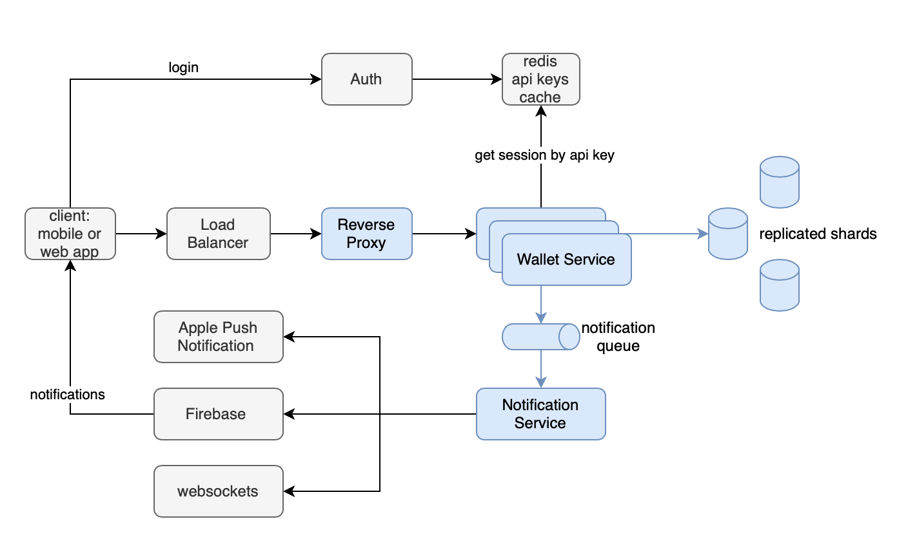

# Wallet Service

WalletService provides a fund transfer solution across Mobile Wallet's user base.

## Requirements
1. User shall be able to transfer money to another user
2. User shall be able to retrieve her balance
3. User shall be able to retrieve her transactions

Security: HTTP-based authentication

Observability: monitoring, logging

## Assumptions

### Business ones

1. User has only one account
   1. In fact, it may be a good feature to add functionality for users to create accounts
   2. This feature also enables users to have account of different currencies
2. Transferable `amount` is an integer
   1. not to hassle with cents for simplicity
3. Transferable `amount` shall be a positive number and less than 1000000 SGD
4. No service fees (also a nice feature to have)
5. No double-entry accounting, thus more simple data model
6. No notification (another good feature proposal - notify users about received money transfer)
7. `user_id` is a string, like username or email.
8. ID of account is an integer

### Technical

1. Authentication based on token (session), which generated on login by Auth Service
2. No User/Auth service, it's out of scope for WalletService
   1. I assume there are sessions stored in redis (not done, see `dependencies.py::get_user_by_token()`)
3. No linters (black, isort, flake8) and precommit hooks
4. No CI jobs
5. Traefik as a proxy, but without TLS termination
6. No UI frontend
7. `requiments.txt` for dependencies, no poetry


## How to start up

### Development environment
I've been developing this on MacOS Monterey 12.2.1,
with Docker Desktop 3.6, Docker Engine 20.10, Docker compose 1.29

### To start it
```
docker-compose up --build
```

This will take some minutes and start postgres, traefik proxy and fastapi backend.

### Some test data
On startup backend will do alembic migrations and populates 4 accounts for testing:
```
wallet=# select id, name, user_id, amount from accounts;
 id |  name   | user_id | amount 
----+---------+---------+--------
 86 | current | andrew  |      0
 84 | current | house   | 1000000
 85 | current | yunus   |      0
 87 | current | nick    |      0
(4 rows)
```
Also, there are 4 hard-coded [tokens](./app/dependencies.py) for users:
```
users = {
    "yunus": "yunus",
    "nick": "nick",
    "house": "house",
    "andrew": "andrew",
}
```
Tokens here are the same as user IDs, for ease testing.

### Run unit tests
````
docker exec -it thunes-wallet_backend_1 /wallet/test.sh
````
I've put quite good amount of test cases for business logic of accounts and trasnfers.
And didn't add tests for API itself, so there is some room for improvements.

There are 23 test case and pytest reports branch code coverage at the end.

### API
Open [http://0.0.0.0:8000/docs](http://0.0.0.0:8000/docs)

token is required, please use one above.

### psql
If you want to see db internals:
```
docker exec -it thunes-wallet_db_1 psql wallet -U postgres
```

## Data model

Check [models](./app/models), specifically - `account.py` and `transaction.py`.
So it's very simple:
- Account has `user_id` and keeps `amount`
- Transaction has two foreign keys to debit account and credit account (I call them sender and receiver),
and `amount` and `message`

I heard about Double entry accounting, but it turned out to be not that easy to implement ;)
Though, it enables such a feature as Transfer Fee in more proper way.

I also suspect that could be a service which has double entry account implemented, including user accounts.
Then money transfer may be built on top of it.

## Design

At high level design could be like this:


For database it's good to choose RDBMS, 
its transactions and denormalisation abilities are very well suited for accounting.

As for data volume we can do some simple estimations:
Let one `transaction` row takes 100 bytes.
Having 100M users who do 1 transfer each day, it gives us 365*100 bytes * 100M/day = 3650 GB/year ~= 4TB/year.
Even with 5 years retention, we need 20 TB.
So sharding is required.
If the service is international, geographical sharding (by regions) may make sense (and wallet backend as well).
Inside the region, `account_id` seems reasonable to be a sharding key.

From performance point of view, 100M requests per day = 1200 req/second.
One may assume that read requests will be x10, so 10K requests/second.
This we can cover by horizontal scaling of wallet service, it's a stateless service, user session is stored in Redis.


### Observability
Logging & Monitoring
I found a couple of exporters/instrumentators for Prometheus metrics :
- https://github.com/stephenhillier/starlette_exporter
- https://github.com/trallnag/prometheus-fastapi-instrumentator
but had no time to explore and play them.

One possible way: add logging driver (for AWS CloudWatch or ELK) and forward logs into logging service.
There we can setup metrics based on logs (40x and 50x errors, rps, request duration)

## Some nice findings
1. there is a effective way of testing with pytest and sqlalchemy
- https://stackoverflow.com/questions/67255653/how-to-set-up-and-tear-down-a-database-between-tests-in-fastapi
- https://docs.sqlalchemy.org/en/14/orm/session_transaction.html#joining-a-session-into-an-external-transaction-such-as-for-test-suites

2. double entry accounting
- https://dba.stackexchange.com/questions/179654/developing-a-database-for-a-funds-transfers-business-where-a-people-and-organi
- https://stackoverflow.com/questions/59432964/relational-data-model-for-double-entry-accounting

3. multiple join paths for sqlalchemy models
- https://docs.sqlalchemy.org/en/14/orm/join_conditions.html

4. sqlalchemy got asyncio support recenty, it'd be interesting to test it
